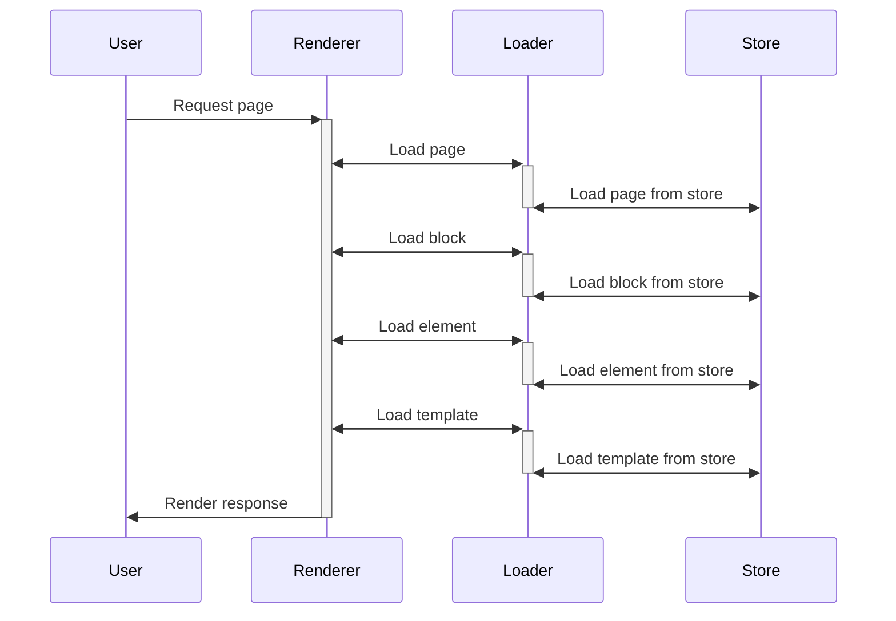

# Page Editor

This is an API first page renderer. There is no editor, nor editing API yet.

It has several endpoints that allow to assemble pages.

- /api/v1/view/{page_name}

It has a nested approach to page creation. Basic mode is just using
builtin blocks, passing some data, and rendering the result. The
elements can be nested themselves. The page is rendered as a single HTML
page, with the elements rendered as if they were in the page.

On a more advanced level, the blocks can be requested to be rendered by
remote endpoints, and the result will be rendered as if it were a builtin
block.

This is structure in stores, which can return HTML with jinja templating,
or raw HTML. Each store has diferent configuration, and can be mixed.

Stores have several functions:

- Pages
- Blocks
- Templates

## Builtin Elements

- Section
- Block
- Image
- Button
- Rich Text
- Markdown
- Video
- Header
- Tag Cloud
- Menu
- Paragraph

## External Elements

To add external elements edit the config.yaml and add the endpoints for the external elements. It
must have thse format:

```yaml
stores:
  - name: myremote
    type: http
    base_url: http://localhost:8080/api/v1/element/
    tags:
      - pages
      - blocks
      - templates

blocks:
  - name: Login Button
    store: myremote
    html: login-button/view.html
    css: login-button/style.css
    tags:
      - jinja2
```

## Config structure and data flow

In the config there are several stores configured, each store is a loader hat can get data in a way, from filesystem, database, or HTTP.

When viewing a page all stores in order are queried for the given page,first to answer is used.

The page has blocks, for the block we follow the same idea, but first we
heck into the config one, and then maybe on the store.

Each store has its own configuration and may not have blocks pages or
whatever. We use tags to filter out when not needed.

Once we have the definitions, we proceed to render each block, in
parallel, and finally assemble the final page.

The page may have a template, which do the same process, only for
template stores, and sets the children.

The sequence diagram is the following:



The renderer may need to change the response in some ways, for example
jinja templating, or nothing.

The loader can actually use the block data to render it itself and do not
require any more templating.
